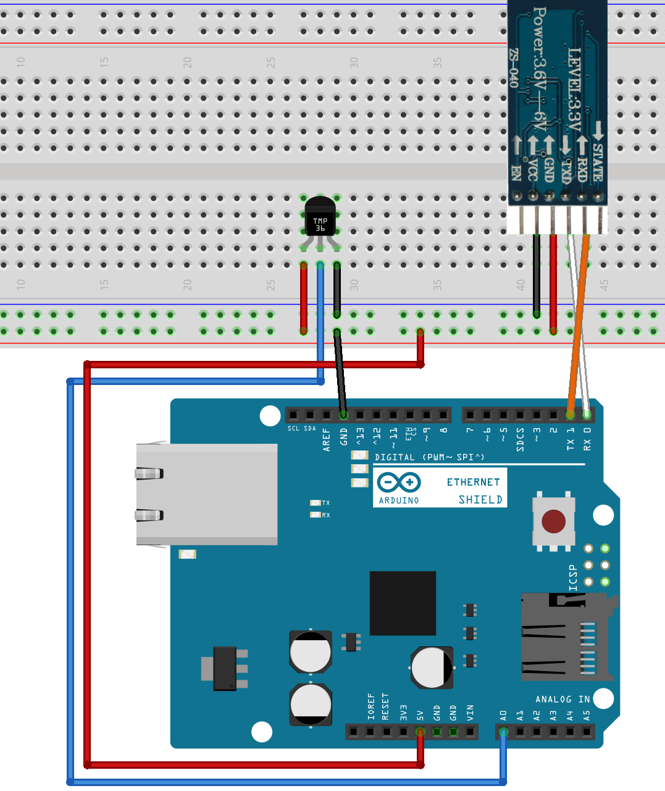
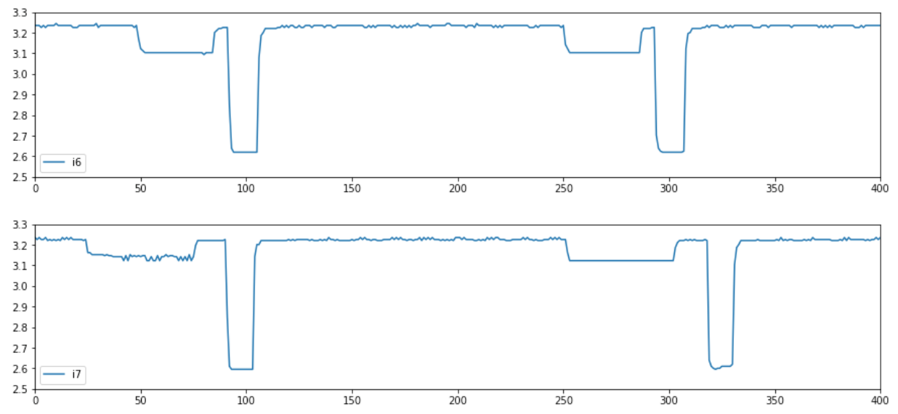
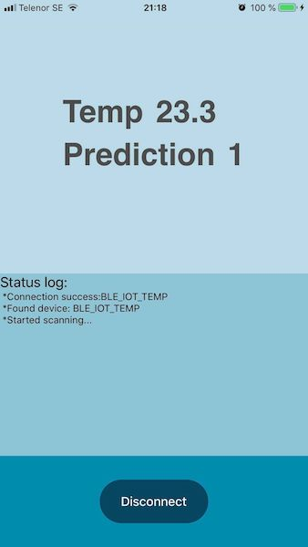

## Machine learning on small embedded systems 

### Overall description of the
system 

The goal of this work is to develop a PoC to implement Machine learning
in a small device for 2 weeks. 

#### Device: 
- IoT device should be in class
with a Atmel328p MC in order to demonstrate the ability on similar hardware
class. 
- IoT device has constant power supply. 
- IoT device via BLE send both
sensor data and results of classification at least once/second 

####
Classification: 

- Should be based on sensor data and a trained ML model. 
-
The system shall be able to carry out the classification of at least two (2)
different classes based on sensor data. 
- The model should be able to carry out
continious prediction based on an input of at least 5 data points (Int16) within
one (1) second 

#### Central Unit: ¶  

The system should send sensor/rating
outcomes via BLE to a Console app (shall) and mobile app (should) 

In line with
the large increase in connected devices creating large amounts of "sensor" data.
Where appropriate, trained machine-learning models can carry out huge complex
analysis and classification of sensor data and predict trends/classify.
While it
is good to be able to send large volumes of data for analysis online, this can
be problemmatic if internet connection is critical or injuries/damage could
occur. 

### Why? 

It may be advisable to be able to perform analyses in the
local environment, called Edge Computing. This can be achived with a computing
unit than can receive data from multiple sensors in real time, filter and
analyze the data and finally send a "batch" to an online instance for further
analysis or user interface. 

In some cases, there may even be a requirement for
immediate action without any delays. For example, the local network might be
down or overloaded. There may be a safety aspect with possible personal hazards
or major financial losses, and then the right solution should be chosen. 

###
What 

This work involves implementing such a solution where classification
takes place directly in a "thin" IoT device. 

### System overview  


###
Elscheman på relevanta delar


### Conslusions
The temp sensor I had
available was not very accurate. Its possible that a sensor with better accuracy
could yield better training data

Its intresting to use research work and apply
it to your own problem, epecially when information and dokumentation was still
under development

It became a part debug and ingenuity to make it work.
Besides the ML part I got familiar with the BLE protocol and implemented an end-
to-end solution with a mobile app.

## Workflow

### 1 Recreate the work (bonsai model) från Microsoft
https://github.com/Microsoft/EdgeML


### 2 Verify it worked on my own hardware
This was done in two steps
Step 1: In a PC environment using the USPS10 dataset
(Handwriten digits)
https://www.csie.ntu.edu.tw/~cjlin/libsvmtools/datasets/multiclass.html#usps
Ref: J. J. Hull. 
A database for handwritten text recognition research. 
IEEE
Transactions on Pattern Analysis and Machine Intelligence, 16(5):550-554, May
1994.

Step 2:  Using a custom dataset 


### 3 Runing on atmel238
https://github.com/Microsoft/EdgeML/tree/fixed-point/fixed-point
Get the model
runing on the hardware was a bit challenging, the output for this was for
arduino and I neede it to be plain C so I could flash it using AVR

### 4 Create
custom dataset and train a model
The idea was that I different mobile flashes
acted differently, an ML model could be used to classify different
phones/flashes.

I started using a photoresistor and sampled light data which I
lates analyzed with pandas and matplotlib.

How different flash looked like
after sampling data. Here an Iphone 7 and 6


```python
#Data from a temperature sonsor.
from matplotlib import pyplot as plt
import pandas as pd

dataClassOne = [26.25,26.25,26.25,26.25,27.15,27.22,27.71,26.71,26.31,26.22]
dataClassOTwo = [26.25,26.35,26.35,26.25,26.15,26.22,26.21,26.21,26.31,26.22]
df = pd.DataFrame(dataClassOne, columns=['Anomaly'])
df_2 = pd.DataFrame(dataClassOTwo, columns=['Normal'])
df.plot(figsize=(10,3))

df_2.plot(figsize=(10,3))
plt.ylim(26,28)

```

### Create final dataset

In order to capture flashes and create a dataset i
created a sampler(data recorder) program in C.

First I checked how long a flash
lasted. For example 2 seconds. (This includes a preflash sequence with lower
light)
I assume this is a measuring phase where the phone meassures the the
current lightning conditions and adapts the falsh after it.

Then the recoder
program would read data from the photoresistor for flashtime + buffer to ensure
the sequence is captured without breaks. ex: normal - flash - normal

Lastly the
recoder would loop for x times.
For example If i wanted to take 50 samples of
flashes from an Iphone5 i would set the loop counter to 50 and then I would make
a flash for each round.

I repeted this with 3 differnet kind of phones, taking
flashes under the same conditions and distance from the sensor.

Limitations:
This is just an experiment under an isolated environment. In reality the
distance between the phone and the sensor, combined with ambient light
conditions would greatly alter the recorded data.

### 5 Create AVR software for the sensor in C
The program reads the input data
from the sensor with an interval of 10 meassurements/second
The input length of
a sample to make a prediction is 20.

In order to start "recording" a sample, I
put on a threshold value on the sensor.
Whenever the sensor received a light
greater than the ambient value, the recorder would start sampling data.
After
the sample is complete, a classification in done.

At the same time the result
is sent to the BLE module with correspoding output class.
1, 2 or 3 for each
phone.

### BLE Module. 
The Atmel card had a BLE module connected to an UART
port, I configured the module as a peripheral and I culd send data using the
standard printf command.
The data was then sent to whatever deviced was
connected/paired to the BLE module.

### Consol app
* under /bleclient
```
#From
/bleclient, module name/UUID hardcoded
npm install
node app.js
```
Simple
console BLE app. It will scan for the BLE module and connect to it. It will then
print classification results.


### iOS application
(Note, image for
demostration. Here I used a temp sensor to predict with a previous model)

Using
the following lib to use BLE.
* https://github.com/Polidea/react-native-ble-plx
* /bleclient/test (react-native, tested on iOS 12)
```
#From
/bleclient/react_app
npm install
react-native upgrade
react-native link
react-
native run-ios
```


### Security
Due to the short time to make this project
work, no security was added to the hardware or software.


#### References
Hardware:
* Ardiuno UNO R3
* MLT-BT05 BLE Module
* TMP36 Temp
sensor
-----
* Machine learning:
*
https://github.com/Microsoft/EdgeML/tree/master/cpp/src/Bonsai Mahine learning
Model (MIT)
* https://github.com/Microsoft/EdgeML/tree/fixed-point/fixed-point
Atmel328 Example implementation (MIT)
----
* BLE:
*
https://github.com/noble/noble Noble NodeJS (MIT)
*
https://github.com/Polidea/react-native-ble-plx React-native app BLE (Apache
License 2.0)
* https://facebook.github.io/react-native/ React-native (MIT)
